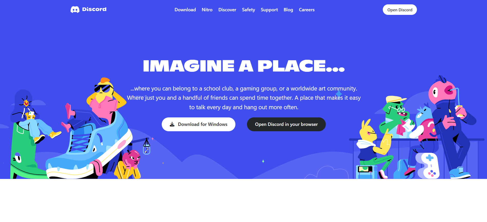
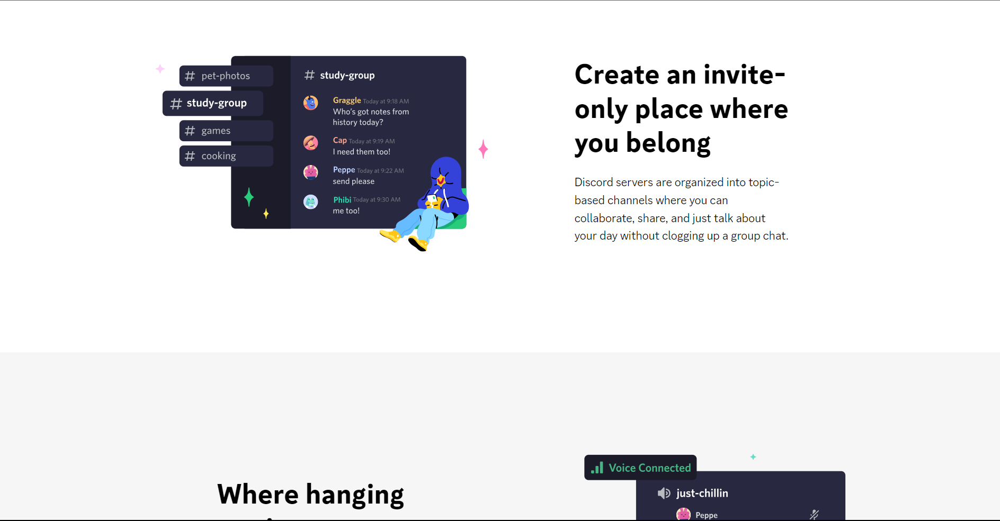
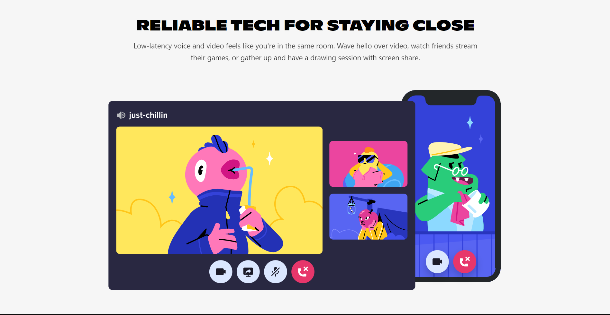
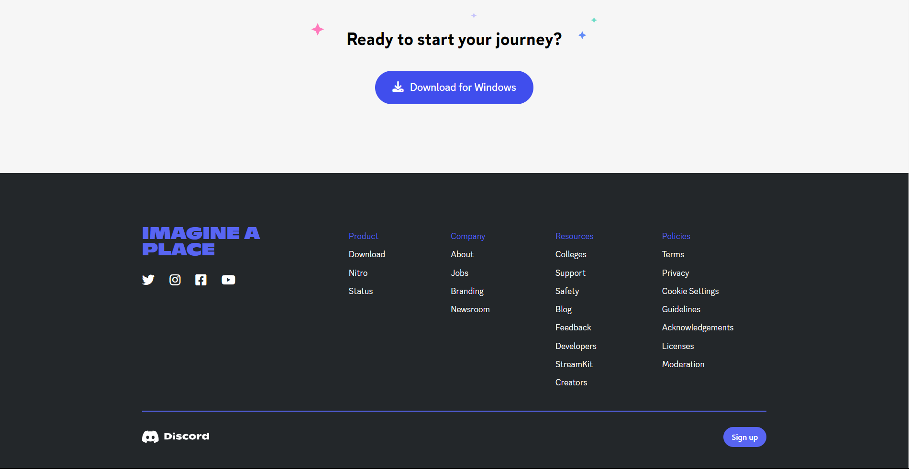

# Discord Official Website Clone

The Discord Official Website Clone is a web project that replicates the official Discord website's user interface. This project serves as a demonstration of front-end development skills and showcases a pixel-perfect UI clone of the Discord website using HTML and Tailwind CSS.






## Table of Contents

- [Overview](#overview)
- [Installation](#installation)
- [Usage](#usage)
- [Technologies Used](#technologies-used)
- [Contributing](#contributing)
- [License](#license)

## Overview

The Discord Official Website Clone project aims to replicate the official Discord website's user interface with precision. Key highlights of the project include:

- **Pixel-Perfect UI:** The project meticulously recreates the Discord website's appearance, ensuring accuracy and attention to detail.

- **Styling Skills Improvement:** By cloning a complex and well-designed website, the project provides an opportunity to improve front-end styling skills.

- **Concept Clarity:** The project serves as a valuable exercise in understanding and implementing various front-end concepts.

This clone project demonstrates the ability to create high-quality UI replicas and enhance front-end development skills.

## Installation

1. Clone the repository:

   ```bash
   git clone https://github.com/sargunkohli152/Discord-Clone.git

2. Start the application

    ```bash
    npm run start

## Usage
 - The project is intended for educational purposes and to showcase your front-end 
   development skills.

 - Study the codebase to understand how the Discord website's UI is replicated using HTML 
   and Tailwind CSS.

 - Use the project as a reference or starting point for your front-end development 
   projects.

## Technologies Used
 - HTML
 - Tailwind CSS


## Contributing
Contributions are welcome! If you have any suggestions, improvements, or want to add new features to enhance the Discord Official Website Clone, please fork the project, make your changes, and submit a pull request.

## License
MIT License

Permission is hereby granted, free of charge, to any person obtaining a copy of this software and associated documentation files (the "Software"), to deal in the Software without restriction, including without limitation the rights to use, copy, modify, merge, publish, distribute, sublicense, and/or sell copies of the Software, and to permit persons to whom the Software is furnished to do so, subject to the following conditions:

The above copyright notice and this permission notice shall be included in all copies or substantial portions of the Software.

THE SOFTWARE IS PROVIDED "AS IS", WITHOUT WARRANTY OF ANY KIND, EXPRESS OR IMPLIED, INCLUDING BUT NOT LIMITED TO THE WARRANTIES OF MERCHANTABILITY, FITNESS FOR A PARTICULAR PURPOSE AND NONINFRINGEMENT. IN NO EVENT SHALL THE AUTHORS OR COPYRIGHT HOLDERS BE LIABLE FOR ANY CLAIM, DAMAGES OR OTHER LIABILITY, WHETHER IN AN ACTION OF CONTRACT, TORT OR OTHERWISE, ARISING FROM, OUT OF OR IN CONNECTION WITH THE SOFTWARE OR THE USE OR OTHER DEALINGS IN THE SOFTWARE.
